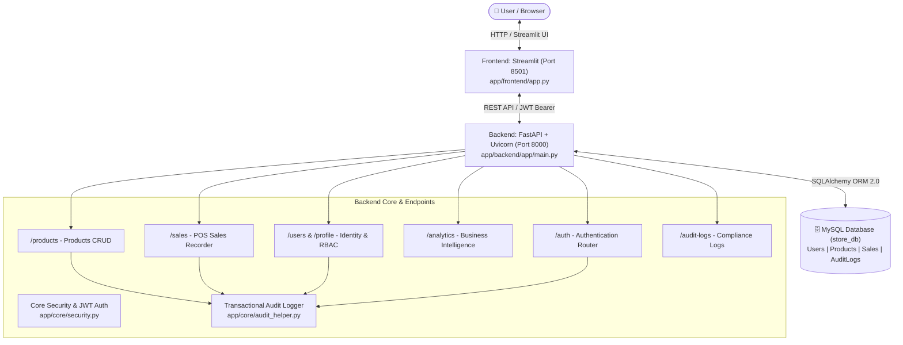
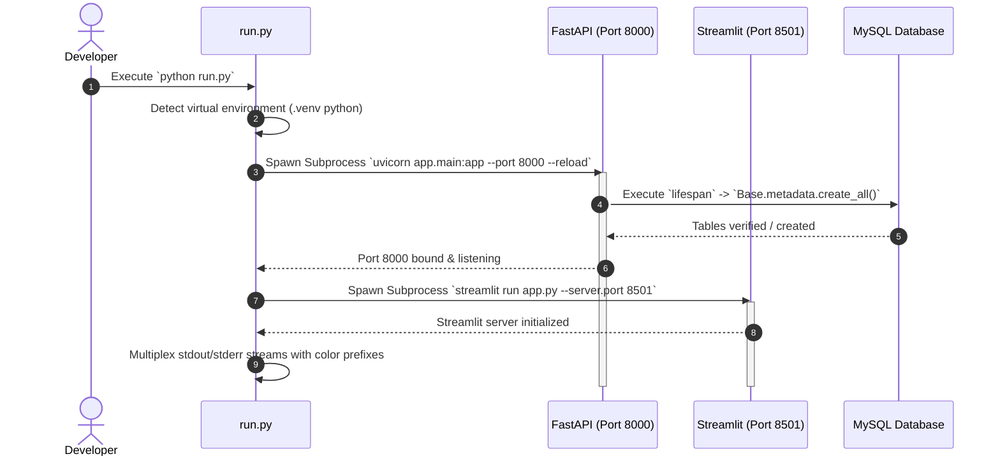
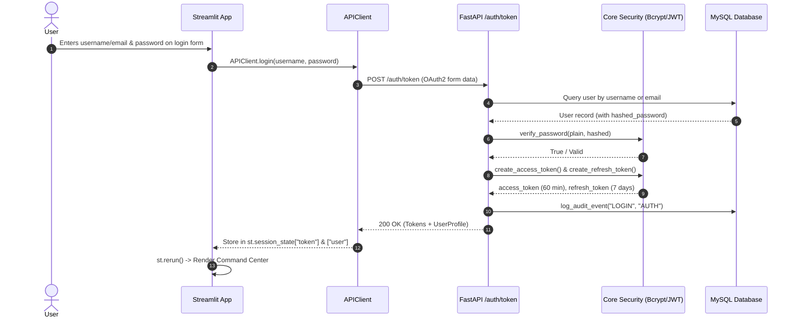
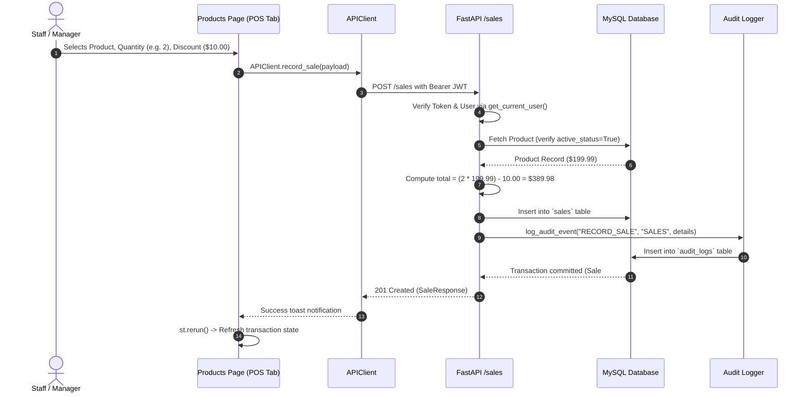
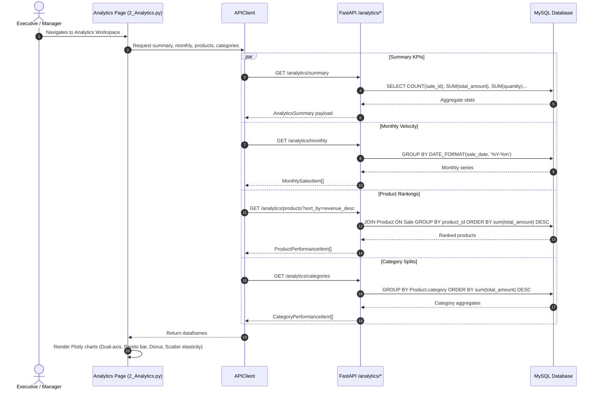
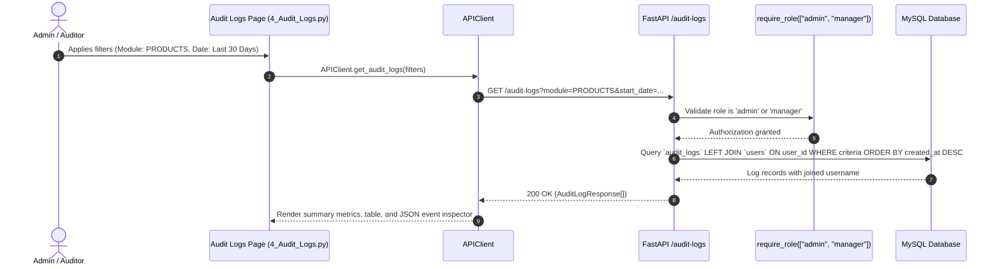
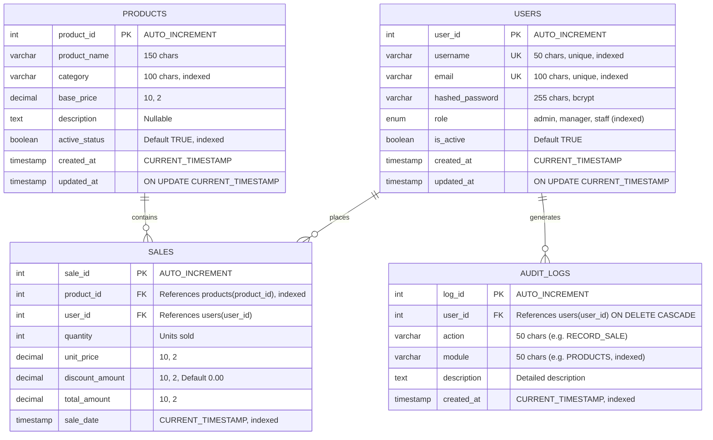

# 📘 Product & Analytics Management System — Comprehensive Architecture & File Overview

A complete technical overview of the **Product & Analytics Management System**, detailing every file in the repository, its specific role, the underlying system architecture, data models, role-based access control (RBAC), and end-to-end program execution flows.

---

## 📑 Table of Contents

1. [System Architecture Overview](#1-system-architecture-overview)
2. [Complete Directory & File Tree](#2-complete-directory--file-tree)
3. [File-by-File Breakdown & Description](#3-file-by-file-breakdown--description)
   - [Root Orchestration & Configuration Files](#root-orchestration--configuration-files)
   - [Database Schema & Seeders](#database-schema--seeders)
   - [Backend Core Architecture (`app/backend/app/core/`)](#backend-core-architecture-appbackendappcore)
   - [Backend Database Models (`app/backend/app/models/`)](#backend-database-models-appbackendappmodels)
   - [Backend Pydantic Schemas (`app/backend/app/schemas/`)](#backend-pydantic-schemas-appbackendappschemas)
   - [Backend API Routers (`app/backend/app/api/`)](#backend-api-routers-appbackendappapi)
   - [Backend Automated Test Suite (`app/backend/tests/`)](#backend-automated-test-suite-appbackendtests)
   - [Frontend UI & Workspaces (`app/frontend/`)](#frontend-ui--workspaces-appfrontend)
4. [Program Execution & Data Flows](#4-program-execution--data-flows)
   - [Flow 1: Unified Application Startup](#flow-1-unified-application-startup)
   - [Flow 2: Authentication & JWT Lifecycle](#flow-2-authentication--jwt-lifecycle)
   - [Flow 3: Product Inventory Management & POS Sales Dispatch](#flow-3-product-inventory-management--pos-sales-dispatch)
   - [Flow 4: Analytics Aggregation & Business Intelligence Telemetry](#flow-4-analytics-aggregation--business-intelligence-telemetry)
   - [Flow 5: Audit Trail & Compliance Logging](#flow-5-audit-trail--compliance-logging)
5. [Role-Based Access Control (RBAC) Matrix](#5-role-based-access-control-rbac-matrix)
6. [Database Schema & Entity-Relationship (ER) Map](#6-database-schema--entity-relationship-er-map)

---

## 1. System Architecture Overview

The platform is structured as a decoupled, multi-tier enterprise application composed of:
- **Presentation Tier (Frontend):** Built with **Streamlit**, featuring custom responsive CSS design tokens, Google Fonts (*Plus Jakarta Sans* & *Space Grotesk*), Plotly interactive analytical visualizers, and state-driven session management.
- **Application Tier (Backend API):** Built with **FastAPI** and **Uvicorn**, providing asynchronous REST endpoints, OAuth2 Password Bearer authentication with JWT token pairs (access + refresh), Pydantic v2 data validation, and automated OpenAPI documentation (`/docs`, `/redoc`).
- **Persistence Tier (Database):** **MySQL 8.0+** (with automated fallback support for SQLite in testing) connected via **SQLAlchemy 2.0 ORM** and **PyMySQL**.
- **Unified Orchestrator:** Multi-threaded runner ([run.py](file:///c:/Users/Yadhav%20raj%20D/Downloads/d/Desktop/RAG%20PROJECTS/sales_mini/run.py)) managing process lifecycles, real-time multiplexed terminal logging, and graceful process tree termination across Windows, Linux, and macOS.



---

## 2. Complete Directory & File Tree

```text
sales_mini/
├── .venv/                                   # Python Virtual Environment
├── PROJECT_SETUP_SPEC.md                    # Initial architecture & setup specification
├── README.md                                # Quick start and execution instructions
├── OVERVIEW.md                              # Complete system architecture and file guide (this file)
├── run.py                                   # Master multi-process launcher for Backend & Frontend
├── run.bat                                  # Windows CMD / Double-click launcher
├── run.ps1                                  # Windows PowerShell launcher
├── run.sh                                   # Linux / macOS Bash launcher
│
└── app/
    ├── schema.sql                           # Raw SQL schema DDL for store_db initialization
    │
    ├── backend/                             # FASTAPI BACKEND SERVICE
    │   ├── .env                             # Environment configuration (DB credentials, secret keys)
    │   ├── .env.example                     # Environment template for deployments
    │   ├── requirements.txt                 # Backend Python package dependencies
    │   ├── seed.py                          # Database initial seed script (users, products, sales, audit)
    │   │
    │   ├── app/
    │   │   ├── __init__.py                  # Backend package marker
    │   │   ├── main.py                      # FastAPI application instance, lifespan hooks, CORS, routers
    │   │   │
    │   │   ├── core/                        # Core infrastructural modules
    │   │   │   ├── __init__.py
    │   │   │   ├── config.py                # Pydantic Settings & environment variable parsing
    │   │   │   ├── database.py              # SQLAlchemy engine, session maker, get_db dependency
    │   │   │   ├── security.py              # Passlib bcrypt hashing, JWT token handling, RBAC dependencies
    │   │   │   └── audit_helper.py          # Helper function for recording transactional audit events
    │   │   │
    │   │   ├── models/                      # SQLAlchemy Declarative ORM Models
    │   │   │   ├── __init__.py
    │   │   │   ├── user.py                  # User model & UserRole enum (admin, manager, staff)
    │   │   │   ├── product.py               # Product model (name, category, price, status)
    │   │   │   ├── sale.py                  # Sale model (quantities, pricing, discounts, timestamps)
    │   │   │   └── audit.py                 # AuditLog model (actions, modules, actor IDs)
    │   │   │
    │   │   ├── schemas/                     # Pydantic v2 Validation & Serialization Schemas
    │   │   │   ├── __init__.py
    │   │   │   ├── user.py                  # UserBase, UserCreate, UserUpdate, Token, TokenPayload
    │   │   │   ├── product.py               # ProductCreate, ProductUpdate, ProductResponse, ProductFilter
    │   │   │   ├── sale.py                  # SaleCreate, SaleResponse
    │   │   │   ├── analytics.py             # AnalyticsSummary, MonthlySalesItem, ProductPerformanceItem
    │   │   │   └── audit.py                 # AuditLogCreate, AuditLogResponse
    │   │   │
    │   │   └── api/                         # FastAPI REST Route Controllers
    │   │       ├── __init__.py
    │   │       ├── auth.py                  # /auth/token, /auth/refresh
    │   │       ├── products.py              # /products (GET, POST, PUT, DELETE)
    │   │       ├── sales.py                 # /sales (POST sale, GET sales history)
    │   │       ├── analytics.py             # /analytics/summary, /monthly, /products, /categories
    │   │       ├── users.py                 # /profile (GET, PUT), /users (Admin CRUD)
    │   │       └── audit.py                 # /audit-logs, /audit-logs/{id}
    │   │
    │   └── tests/                           # Pytest Automated Test Suite
    │       ├── conftest.py                  # Pytest fixtures, in-memory SQLite DB, auth tokens
    │       ├── test_health.py               # Health check and root endpoint tests
    │       ├── test_auth.py                 # Login, refresh token, invalid credential tests
    │       ├── test_products.py             # Product creation, listing, RBAC permissions, filters
    │       ├── test_users.py                # Profile update, password verification, admin user creation
    │       ├── test_analytics.py            # KPI metrics, monthly aggregation, product rankings
    │       └── test_audit.py                # Audit log querying and role restriction tests
    │
    └── frontend/                            # STREAMLIT FRONTEND SERVICE
        ├── requirements.txt                 # Frontend Python package dependencies
        ├── app.py                           # Application gateway, login screen, Command Center dashboard
        │
        ├── utils/                           # Frontend Utilities & Helper Modules
        │   ├── __init__.py
        │   ├── api_client.py                # Centralized HTTP request client with Bearer token injection
        │   └── ui_theme.py                  # Custom CSS design system, typography, cards, badges, hero
        │
        └── pages/                           # Streamlit Multi-Page App Modules
            ├── 1_Products.py                # Product catalog explorer, live search, item editor & POS checkout
            ├── 2_Analytics.py                # Executive BI, monthly trend lines, Pareto charts, elasticity scatter
            ├── 3_Profile.py                 # User identity card, password reset, Admin enterprise directory
            └── 4_Audit_Logs.py              # Compliance audit trail, date/module filters, JSON payload inspector
```

---

## 3. File-by-File Breakdown & Description

### Root Orchestration & Configuration Files

#### [`run.py`](file:///c:/Users/Yadhav%20raj%20D/Downloads/d/Desktop/RAG%20PROJECTS/sales_mini/run.py)
- **Role:** Centralized multi-process service runner and orchestration entry point.
- **Key Responsibilities:**
  - Automatically identifies the active Python virtual environment (`.venv/Scripts/python.exe` on Windows or `.venv/bin/python` on POSIX).
  - Spawns the **FastAPI** backend via `uvicorn app.main:app` in a dedicated subprocess on port `8000` (configurable).
  - Spawns the **Streamlit** frontend via `streamlit run app.py` on port `8501` (configurable) with automatic `PYTHONPATH` resolution.
  - Runs asynchronous worker threads that capture `stdout`/`stderr` from both processes and multiplexes them cleanly with ANSI color codes (`[Backend]` in Cyan, `[Frontend]` in Green).
  - Traps `SIGINT` (Ctrl + C) and `SIGTERM` signals to terminate the entire process tree cleanly across operating systems (`taskkill` on Windows, process group termination on Unix), preventing orphaned background processes.

#### [`run.bat`](file:///c:/Users/Yadhav%20raj%20D/Downloads/d/Desktop/RAG%20PROJECTS/sales_mini/run.bat)
- **Role:** Windows batch script for one-click startup from Command Prompt or File Explorer.
- **Key Responsibilities:**
  - Changes directory to the project root.
  - Detects if `.venv\Scripts\python.exe` exists and delegates execution to `run.py` passing along all CLI arguments (`%*`).

#### [`run.ps1`](file:///c:/Users/Yadhav%20raj%20D/Downloads/d/Desktop/RAG%20PROJECTS/sales_mini/run.ps1)
- **Role:** Windows PowerShell script launcher with execution policy support and formatted feedback.

#### [`run.sh`](file:///c:/Users/Yadhav%20raj%20D/Downloads/d/Desktop/RAG%20PROJECTS/sales_mini/run.sh)
- **Role:** Unix/macOS Shell script launcher with automatic virtualenv detection and executable permissions handling.

#### [`README.md`](file:///c:/Users/Yadhav%20raj%20D/Downloads/d/Desktop/RAG%20PROJECTS/sales_mini/README.md)
- **Role:** Quick-start documentation providing launch commands, service URLs, CLI parameter options, and default port configurations.

#### [`PROJECT_SETUP_SPEC.md`](file:///c:/Users/Yadhav%20raj%20D/Downloads/d/Desktop/RAG%20PROJECTS/sales_mini/PROJECT_SETUP_SPEC.md)
- **Role:** Initial engineering specification document containing raw terminal scaffolding commands, DDL schema, and API endpoint contracts.

---

### Database Schema & Seeders

#### [`app/schema.sql`](file:///c:/Users/Yadhav%20raj%20D/Downloads/d/Desktop/RAG%20PROJECTS/sales_mini/app/schema.sql)
- **Role:** Raw MySQL Data Definition Language (DDL) file.
- **Key Responsibilities:**
  - Creates the database `store_db` with `utf8mb4` encoding and `utf8mb4_unicode_ci` collation.
  - Defines table structures for `users`, `products`, `sales`, and `audit_logs`.
  - Establishes relational foreign keys:
    - `sales.product_id` ➔ `products.product_id`
    - `sales.user_id` ➔ `users.user_id`
    - `audit_logs.user_id` ➔ `users.user_id` (with `ON DELETE CASCADE`)
  - Configures optimized indexing on frequently queried columns (`role`, `category`, `active_status`, `sale_date`, `module`, `created_at`).

#### [`app/backend/seed.py`](file:///c:/Users/Yadhav%20raj%20D/Downloads/d/Desktop/RAG%20PROJECTS/sales_mini/app/backend/seed.py)
- **Role:** Standalone database initialization and data seeding script.
- **Key Responsibilities:**
  - Invokes `Base.metadata.create_all()` to ensure all MySQL tables exist.
  - Seeds 3 standard role-delineated user accounts with bcrypt-hashed passwords:
    - **Admin:** `admin` / `adminpassword123`
    - **Manager:** `manager_alex` / `managerpassword123`
    - **Staff:** `staff_emma` / `staffpassword123`
  - Populates a diverse 11-item product catalog across Electronics, Audio, Accessories, Furniture, Lighting, and Kitchen.
  - Generates 120 realistic synthetic sales transactions spread over a 6-month historical timeline with weighted order quantities and randomized promotional discounts.
  - Records initial system audit log events.

---

### Backend Core Architecture (`app/backend/app/core/`)

#### [`app/backend/app/core/config.py`](file:///c:/Users/Yadhav%20raj%20D/Downloads/d/Desktop/RAG%20PROJECTS/sales_mini/app/backend/app/core/config.py)
- **Role:** Centralized configuration management using Pydantic Settings (`BaseSettings`).
- **Key Responsibilities:**
  - Reads environment variables from `app/backend/.env`.
  - Exposes database connection properties (`DB_HOST`, `DB_PORT`, `DB_USER`, `DB_PASSWORD`, `DB_NAME`).
  - Dynamically builds the SQLAlchemy connection URI: `mysql+pymysql://<user>:<pwd>@<host>:<port>/<dbname>`.
  - Defines JWT token parameters (`SECRET_KEY`, `ALGORITHM = "HS256"`, `ACCESS_TOKEN_EXPIRE_MINUTES = 60`).

#### [`app/backend/app/core/database.py`](file:///c:/Users/Yadhav%20raj%20D/Downloads/d/Desktop/RAG%20PROJECTS/sales_mini/app/backend/app/core/database.py)
- **Role:** SQLAlchemy database engine and session factory provider.
- **Key Responsibilities:**
  - Initializes the SQLAlchemy `Engine` with connection pooling configurations (`pool_pre_ping=True`, `pool_recycle=3600`).
  - Creates the `SessionLocal` class bound to the engine.
  - Defines `Base = declarative_base()` for all ORM models.
  - Implements the `get_db()` generator dependency used across FastAPI endpoints to provide scoped database sessions that automatically close upon request completion.

#### [`app/backend/app/core/security.py`](file:///c:/Users/Yadhav%20raj%20D/Downloads/d/Desktop/RAG%20PROJECTS/sales_mini/app/backend/app/core/security.py)
- **Role:** Security, password hashing, JWT encoding/decoding, and Role-Based Access Control (RBAC).
- **Key Responsibilities:**
  - `verify_password(plain, hashed)`: Validates plaintext credentials against bcrypt hashes using Passlib `CryptContext`.
  - `get_password_hash(password)`: Generates salted bcrypt hashes.
  - `create_access_token(data, expires_delta)`: Encodes a short-lived (60 min) JWT containing the user identity, user ID, role, and token type.
  - `create_refresh_token(data, expires_delta)`: Encodes a long-lived (7 days) JWT for refreshing expired sessions.
  - `verify_refresh_token(token)`: Decodes and validates refresh tokens.
  - `get_current_user(token, db)`: Dependency that extracts and decodes the Bearer token from incoming request headers, fetches the active user record from the database, and rejects inactive users.
  - `require_role(allowed_roles)`: Higher-order dependency factory that enforces RBAC authorization (e.g. `require_role(["admin", "manager"])`), returning HTTP 403 Forbidden if the user's role is not authorized.

#### [`app/backend/app/core/audit_helper.py`](file:///c:/Users/Yadhav%20raj%20D/Downloads/d/Desktop/RAG%20PROJECTS/sales_mini/app/backend/app/core/audit_helper.py)
- **Role:** Transactional audit trail helper.
- **Key Responsibilities:**
  - `log_audit_event(db, user_id, action, module, description)`: Instantiates an `AuditLog` model and flushes it into the ongoing database transaction so that mutations and audit logs commit atomically.

---

### Backend Database Models (`app/backend/app/models/`)

#### [`app/backend/app/models/user.py`](file:///c:/Users/Yadhav%20raj%20D/Downloads/d/Desktop/RAG%20PROJECTS/sales_mini/app/backend/app/models/user.py)
- **Role:** SQLAlchemy ORM model for the `users` table.
- **Fields:** `user_id` (PK), `username` (Unique), `email` (Unique), `hashed_password`, `role` (`UserRole` Enum: `admin`, `manager`, `staff`), `is_active` (Boolean), `created_at`, `updated_at`.
- **Relationships:** `sales` (1-to-many with `Sale`), `audit_logs` (1-to-many with `AuditLog`, cascade delete).

#### [`app/backend/app/models/product.py`](file:///c:/Users/Yadhav%20raj%20D/Downloads/d/Desktop/RAG%20PROJECTS/sales_mini/app/backend/app/models/product.py)
- **Role:** SQLAlchemy ORM model for the `products` table.
- **Fields:** `product_id` (PK), `product_name`, `category`, `base_price` (Numeric), `description` (Text), `active_status` (Boolean, soft-delete flag), `created_at`, `updated_at`.
- **Relationships:** `sales` (1-to-many with `Sale`).

#### [`app/backend/app/models/sale.py`](file:///c:/Users/Yadhav%20raj%20D/Downloads/d/Desktop/RAG%20PROJECTS/sales_mini/app/backend/app/models/sale.py)
- **Role:** SQLAlchemy ORM model for the `sales` table.
- **Fields:** `sale_id` (PK), `product_id` (FK ➔ `products.product_id`), `user_id` (FK ➔ `users.user_id`), `quantity` (Int), `unit_price` (Numeric), `discount_amount` (Numeric), `total_amount` (Numeric), `sale_date` (DateTime).
- **Relationships:** `product` (many-to-1 with `Product`), `user` (many-to-1 with `User`).

#### [`app/backend/app/models/audit.py`](file:///c:/Users/Yadhav%20raj%20D/Downloads/d/Desktop/RAG%20PROJECTS/sales_mini/app/backend/app/models/audit.py)
- **Role:** SQLAlchemy ORM model for the `audit_logs` table.
- **Fields:** `log_id` (PK), `user_id` (FK ➔ `users.user_id`), `action` (String, e.g. `LOGIN`, `RECORD_SALE`), `module` (String, e.g. `AUTH`, `PRODUCTS`), `description` (Text), `created_at` (DateTime).
- **Relationships:** `user` (many-to-1 with `User`).

---

### Backend Pydantic Schemas (`app/backend/app/schemas/`)

#### [`app/backend/app/schemas/user.py`](file:///c:/Users/Yadhav%20raj%20D/Downloads/d/Desktop/RAG%20PROJECTS/sales_mini/app/backend/app/schemas/user.py)
- **Schemas:**
  - `UserRoleEnum`: Enum values (`admin`, `manager`, `staff`).
  - `UserBase`: Shared fields (`username`, `email`, `role`, `is_active`).
  - `UserCreate`: Validation for user creation (includes plaintext password >= 6 chars).
  - `UserUpdate`: Optional fields for administrative user updates.
  - `UserProfileUpdate`: Self-service profile modifications (email, current password validation, new password).
  - `UserRead`: Serialization model returning user attributes without exposing password hashes (`from_attributes = True`).
  - `Token`: Response payload containing `access_token`, `refresh_token`, `token_type`, and nested `UserRead`.
  - `TokenRefreshRequest`: Payload containing `refresh_token`.
  - `TokenPayload`: Decoded JWT payload structure (`sub`, `role`, `user_id`, `token_type`, `exp`).

#### [`app/backend/app/schemas/product.py`](file:///c:/Users/Yadhav%20raj%20D/Downloads/d/Desktop/RAG%20PROJECTS/sales_mini/app/backend/app/schemas/product.py)
- **Schemas:**
  - `ProductBase`: Core product attributes (`product_name`, `category`, `base_price`, `description`, `active_status`).
  - `ProductCreate`: Payload for provisioning new inventory items.
  - `ProductUpdate`: Optional fields for modifying existing products.
  - `ProductResponse`: Full product schema with database `product_id`, `created_at`, `updated_at`.
  - `ProductFilter`: Query criteria structure (`category`, `active_status`, `search`).

#### [`app/backend/app/schemas/sale.py`](file:///c:/Users/Yadhav%20raj%20D/Downloads/d/Desktop/RAG%20PROJECTS/sales_mini/app/backend/app/schemas/sale.py)
- **Schemas:**
  - `SaleCreate`: Input schema for recording checkouts (`product_id`, `quantity`, `unit_price`, `discount_amount`).
  - `SaleResponse`: Formatted sale receipt with `sale_id`, calculated `total_amount`, and timestamp `sale_date`.

#### [`app/backend/app/schemas/analytics.py`](file:///c:/Users/Yadhav%20raj%20D/Downloads/d/Desktop/RAG%20PROJECTS/sales_mini/app/backend/app/schemas/analytics.py)
- **Schemas:**
  - `AnalyticsSummary`: High-level business KPI metrics (total orders, total revenue, units sold, average ticket size, active products count, total user accounts).
  - `MonthlySalesItem`: Monthly aggregated financial telemetry (`month`, `total_orders`, `total_quantity`, `total_revenue`).
  - `ProductPerformanceItem`: Granular product sales ranking (`product_id`, `product_name`, `category`, `base_price`, `total_quantity_sold`, `total_revenue`).
  - `CategoryPerformanceItem`: Category breakdown metrics (`category`, `total_products`, `total_quantity_sold`, `total_revenue`).

#### [`app/backend/app/schemas/audit.py`](file:///c:/Users/Yadhav%20raj%20D/Downloads/d/Desktop/RAG%20PROJECTS/sales_mini/app/backend/app/schemas/audit.py)
- **Schemas:**
  - `AuditLogBase`: `action`, `module`, `description`.
  - `AuditLogCreate`: Includes `user_id`.
  - `AuditLogResponse`: Serialized log entry including `log_id`, `user_id`, joined `username`, and `created_at`.

---

### Backend API Routers (`app/backend/app/api/`)

#### [`app/backend/app/main.py`](file:///c:/Users/Yadhav%20raj%20D/Downloads/d/Desktop/RAG%20PROJECTS/sales_mini/app/backend/app/main.py)
- **Role:** FastAPI application factory and top-level router coordinator.
- **Key Responsibilities:**
  - Implements an asynchronous `lifespan` context manager that automatically initializes database tables via `Base.metadata.create_all(bind=engine)` upon startup.
  - Registers permissive CORS middleware (`allow_origins=["*"]`, `allow_methods=["*"]`).
  - Mounts all sub-routers: `auth`, `products`, `sales`, `analytics`, `users`, `audit`.
  - Exposes public health-check endpoints: `GET /health` and `GET /`.

#### [`app/backend/app/api/auth.py`](file:///c:/Users/Yadhav%20raj%20D/Downloads/d/Desktop/RAG%20PROJECTS/sales_mini/app/backend/app/api/auth.py)
- **Endpoints:**
  - `POST /auth/token`: Authenticates username or email against bcrypt hashes using standard `OAuth2PasswordRequestForm`. Issues signed JWT access and refresh token pairs and records an audit log entry for successful logins.
  - `POST /auth/refresh`: Validates refresh tokens and issues refreshed access and refresh token pairs.

#### [`app/backend/app/api/products.py`](file:///c:/Users/Yadhav%20raj%20D/Downloads/d/Desktop/RAG%20PROJECTS/sales_mini/app/backend/app/api/products.py)
- **Endpoints:**
  - `GET /products`: Authenticated listing of products supporting case-insensitive search (`ilike`), category filtering, active status filtering, and pagination (`limit`, `offset`).
  - `GET /products/{product_id}`: Retrieves specific item details by ID.
  - `POST /products`: [Restricted to Admin & Manager] Creates a new catalog item and logs `CREATE_PRODUCT`.
  - `PUT /products/{product_id}`: [Restricted to Admin & Manager] Updates item parameters and logs `UPDATE_PRODUCT`.
  - `DELETE /products/{product_id}`: [Restricted to Admin & Manager] Soft-deletes the product (`active_status = False`) to maintain historical relational integrity and logs `SOFT_DELETE_PRODUCT`.

#### [`app/backend/app/api/sales.py`](file:///c:/Users/Yadhav%20raj%20D/Downloads/d/Desktop/RAG%20PROJECTS/sales_mini/app/backend/app/api/sales.py)
- **Endpoints:**
  - `POST /sales`: Records a customer checkout transaction. Validates product availability and active status, computes total amounts after discounts (`(qty * unit_price) - discount`), commits the sale, and logs `RECORD_SALE`.
  - `GET /sales`: Retrieves sales history filtered optionally by `product_id` or `user_id`.

#### [`app/backend/app/api/analytics.py`](file:///c:/Users/Yadhav%20raj%20D/Downloads/d/Desktop/RAG%20PROJECTS/sales_mini/app/backend/app/api/analytics.py)
- **Endpoints:**
  - `GET /analytics/summary`: Aggregates enterprise KPIs (total revenue, order counts, units dispatched, mean basket value).
  - `GET /analytics/monthly`: Groups revenue and order volume by month with cross-database dialect detection (MySQL `DATE_FORMAT`, SQLite `strftime`, PostgreSQL `to_char`).
  - `GET /analytics/products`: Ranks products by revenue or sales volume ascending/descending.
  - `GET /analytics/categories`: Groups sales performance by catalog product category.

#### [`app/backend/app/api/users.py`](file:///c:/Users/Yadhav%20raj%20D/Downloads/d/Desktop/RAG%20PROJECTS/sales_mini/app/backend/app/api/users.py)
- **Endpoints:**
  - `GET /profile`: Returns the authenticated user's profile.
  - `PUT /profile`: Allows the user to update their email or change their password after verifying their current password.
  - `GET /users`: [Admin only] Lists all registered user accounts with pagination.
  - `GET /users/{user_id}`: [Admin only] Fetches specific user details.
  - `POST /users`: [Admin only] Provisions a new user account with specified role and logs `CREATE_USER`.
  - `PUT /users/{user_id}`: [Admin only] Modifies user roles, active status, or resets passwords, logging `ADMIN_UPDATE_USER`.

#### [`app/backend/app/api/audit.py`](file:///c:/Users/Yadhav%20raj%20D/Downloads/d/Desktop/RAG%20PROJECTS/sales_mini/app/backend/app/api/audit.py)
- **Endpoints:**
  - `GET /audit-logs`: [Admin & Manager only] Queries chronological audit records joined with usernames, supporting multi-dimensional filters (`user_id`, `module`, `action`, `start_date`, `end_date`).
  - `GET /audit-logs/{log_id}`: [Admin & Manager only] Fetches full audit entry details.

---

### Backend Automated Test Suite (`app/backend/tests/`)

#### [`app/backend/tests/conftest.py`](file:///c:/Users/Yadhav%20raj%20D/Downloads/d/Desktop/RAG%20PROJECTS/sales_mini/app/backend/tests/conftest.py)
- **Role:** Pytest configuration, fixtures, and in-memory test database setup.
- **Key Responsibilities:**
  - Configures an in-memory SQLite database (`sqlite:///:memory:`) using `StaticPool`.
  - Seeds isolated test users (`test_admin`, `test_manager`, `test_staff`, `test_inactive`), test inventory items, and test sales.
  - Uses FastAPI `app.dependency_overrides[get_db]` to isolate test runs from live production MySQL databases.
  - Provides pre-authenticated token fixtures: `admin_token`, `manager_token`, `staff_token`.

#### [`app/backend/tests/test_health.py`](file:///c:/Users/Yadhav%20raj%20D/Downloads/d/Desktop/RAG%20PROJECTS/sales_mini/app/backend/tests/test_health.py)
- Tests `GET /` and `GET /health` to ensure service availability and 200 OK responses.

#### [`app/backend/tests/test_auth.py`](file:///c:/Users/Yadhav%20raj%20D/Downloads/d/Desktop/RAG%20PROJECTS/sales_mini/app/backend/tests/test_auth.py)
- Tests credential validation, JWT token structure, refresh token workflows, and rejection of invalid passwords / deactivated accounts.

#### [`app/backend/tests/test_products.py`](file:///c:/Users/Yadhav%20raj%20D/Downloads/d/Desktop/RAG%20PROJECTS/sales_mini/app/backend/tests/test_products.py)
- Tests product retrieval, search filters, category filtering, product creation by Admin/Manager, soft-deletion, and unauthorized modifications by Staff (expecting 403 Forbidden).

#### [`app/backend/tests/test_users.py`](file:///c:/Users/Yadhav%20raj%20D/Downloads/d/Desktop/RAG%20PROJECTS/sales_mini/app/backend/tests/test_users.py)
- Tests self-service profile updates, password verification checks, admin user creation, role modifications, and RBAC barriers.

#### [`app/backend/tests/test_analytics.py`](file:///c:/Users/Yadhav%20raj%20D/Downloads/d/Desktop/RAG%20PROJECTS/sales_mini/app/backend/tests/test_analytics.py)
- Tests calculation accuracy of KPI summaries (`/analytics/summary`), monthly sales grouping (`/analytics/monthly`), product performance sorting (`/analytics/products`), and category metrics (`/analytics/categories`).

#### [`app/backend/tests/test_audit.py`](file:///c:/Users/Yadhav%20raj%20D/Downloads/d/Desktop/RAG%20PROJECTS/sales_mini/app/backend/tests/test_audit.py)
- Tests query filters on `/audit-logs` and verifies that Staff users cannot access audit compliance records.

---

### Frontend UI & Workspaces (`app/frontend/`)

#### [`app/frontend/utils/api_client.py`](file:///c:/Users/Yadhav%20raj%20D/Downloads/d/Desktop/RAG%20PROJECTS/sales_mini/app/frontend/utils/api_client.py)
- **Role:** Centralized HTTP abstraction layer communicating with the FastAPI backend.
- **Key Responsibilities:**
  - Reads `API_BASE_URL` from the environment (defaulting to `http://localhost:8000`).
  - Automatically attaches the `Authorization: Bearer <token>` header from `st.session_state["token"]` to all outbound requests.
  - Automatically captures HTTP 401 Unauthorized errors, clears invalid session states, and raises typed `APIError` exceptions to guide the user back to the login screen.
  - Exposes dedicated methods for authentication, product CRUD, POS sale recording, analytics summaries, profile updates, user governance, and audit logging.

#### [`app/frontend/utils/ui_theme.py`](file:///c:/Users/Yadhav%20raj%20D/Downloads/d/Desktop/RAG%20PROJECTS/sales_mini/app/frontend/utils/ui_theme.py)
- **Role:** Design system, CSS injection, typography, and reusable UI components.
- **Key Responsibilities:**
  - Injects Google Fonts (*Plus Jakarta Sans* and *Space Grotesk*).
  - Configures CSS styling tokens: glassmorphism hero headers, KPI cards with left color-accents (`indigo`, `cyan`, `emerald`, `amber`), badge pills for user roles and status codes (`pill-admin`, `pill-manager`, `pill-staff`, `pill-active`), and hover micro-animations.
  - Provides reusable rendering functions:
    - `apply_custom_theme()`: Injects root stylesheet and styling overrides.
    - `render_hero(title, subtitle, badge)`: Renders a modern gradient hero header.
    - `render_kpi(title, value, icon, color_scheme, subtitle)`: Renders styled KPI metric tiles.
    - `render_sidebar()`: Renders the persistent sidebar user identity widget, active role badge, and sign-out button.

#### [`app/frontend/app.py`](file:///c:/Users/Yadhav%20raj%20D/Downloads/d/Desktop/RAG%20PROJECTS/sales_mini/app/frontend/app.py)
- **Role:** Main Streamlit landing page, authentication gateway, and Command Center dashboard.
- **Key Responsibilities:**
  - **Unauthenticated State:** Displays the login form with credential submission to `/auth/token`, complete with quick-verification credential hints.
  - **Authenticated State:** Displays the Executive Command Center with real-time KPI telemetry cards (Gross Revenue, Total Orders, Average Ticket Value, Active Catalog Count) and 4 interactive workspace navigation cards routing to sub-pages via `st.switch_page`.

#### [`app/frontend/pages/1_Products.py`](file:///c:/Users/Yadhav%20raj%20D/Downloads/d/Desktop/RAG%20PROJECTS/sales_mini/app/frontend/pages/1_Products.py)
- **Role:** Catalog management, inventory inspection, and Point-of-Sale (POS) transaction recording.
- **Key Features:**
  - **POS Dispatch Tab:** Fast checkout interface allowing staff to select active products, specify quantities, override unit prices, apply promotional discounts, and record transactions in the ledger with real-time gross total calculation.
  - **Catalog Explorer Tab:** Live multi-filter search (search query text, active status dropdown, category taxonomy filter).
  - **Product Provisioning:** Expandable form for Admins & Managers to create new catalog items.
  - **Interactive Product Editor:** Expander cards for each item allowing Admins/Managers to modify names, categories, pricing, descriptions, active status, or trigger soft deactivations. Read-only view for Staff.

#### [`app/frontend/pages/2_Analytics.py`](file:///c:/Users/Yadhav%20raj%20D/Downloads/d/Desktop/RAG%20PROJECTS/sales_mini/app/frontend/pages/2_Analytics.py)
- **Role:** Executive Business Intelligence (BI) and revenue telemetry dashboard.
- **Key Features:**
  - **Summary Metrics:** 4 top-level KPI cards (Gross Revenue, Processed Orders, Volume Dispatched, Average Ticket).
  - **Monthly Growth & Velocity Chart:** Dual-axis Plotly visualization combining monthly gross revenue bars with transaction volume spline lines.
  - **Top Performing Products:** Horizontal Pareto ranking bar chart with sorting toggle (Revenue High/Low, Volume High/Low) colored by category.
  - **Category Revenue Split:** Interactive Plotly donut chart depicting percentage revenue distribution across categories.
  - **Price Elasticity & Sales Density:** Multi-variable scatter plot mapping unit base price vs. units sold, with bubble size proportional to product revenue.

#### [`app/frontend/pages/3_Profile.py`](file:///c:/Users/Yadhav%20raj%20D/Downloads/d/Desktop/RAG%20PROJECTS/sales_mini/app/frontend/pages/3_Profile.py)
- **Role:** User identity governance, security credentials, and Admin user management.
- **Key Features:**
  - **Identity Card:** Displays current user ID, username, email, active status, and role badge.
  - **Security Settings:** Expandable self-service form for updating contact email and changing passwords (requires current password verification).
  - **Admin User Management:** (Visible exclusively to Admins) Provisioning form to create new accounts with specific roles, interactive table of all system users, and per-user expanders to modify roles, toggle active status, or reset passwords.

#### [`app/frontend/pages/4_Audit_Logs.py`](file:///c:/Users/Yadhav%20raj%20D/Downloads/d/Desktop/RAG%20PROJECTS/sales_mini/app/frontend/pages/4_Audit_Logs.py)
- **Role:** Chronological compliance audit trail and activity inspection (Restricted to Admins & Managers).
- **Key Features:**
  - **Multi-Filter Controls:** Filter by system module (`AUTH`, `PRODUCTS`, `SALES`, `USERS`, `SYSTEM`), action code (`LOGIN`, `RECORD_SALE`, `CREATE_PRODUCT`, etc.), and start/end dates.
  - **Summary Badges:** Real-time event counts grouped by module.
  - **Interactive Audit Matrix:** Dataframe displaying timestamps, actors, modules, actions, and human-readable descriptions.
  - **JSON Event Inspector:** Detailed JSON payload viewer for inspecting raw log records.

---

## 4. Program Execution & Data Flows

### Flow 1: Unified Application Startup



---

### Flow 2: Authentication & JWT Lifecycle



---

### Flow 3: Product Inventory Management & POS Sales Dispatch



---

### Flow 4: Analytics Aggregation & Business Intelligence Telemetry



---

### Flow 5: Audit Trail & Compliance Logging



---

## 5. Role-Based Access Control (RBAC) Matrix

The system enforces strict multi-tier role authorization across both backend API endpoints and frontend interface controls:

| Feature / Action | Staff | Manager | Admin | Backend Guard |
| :--- | :---: | :---: | :---: | :--- |
| **Authenticate / Log In** | ✅ | ✅ | ✅ | Public (`/auth/token`) |
| **View Command Center Telemetry** | ✅ | ✅ | ✅ | `get_current_user` |
| **Browse Product Catalog & Search** | ✅ | ✅ | ✅ | `get_current_user` |
| **Dispatch Sales / Record Orders (POS)** | ✅ | ✅ | ✅ | `get_current_user` |
| **View Sales History** | ✅ | ✅ | ✅ | `get_current_user` |
| **View Executive BI & Plotly Charts** | ✅ | ✅ | ✅ | `get_current_user` |
| **Update Own Profile & Password** | ✅ | ✅ | ✅ | `get_current_user` |
| **Create New Products** | ❌ *(Read-only)* | ✅ | ✅ | `require_role(["admin", "manager"])` |
| **Edit Product Details & Pricing** | ❌ *(Read-only)* | ✅ | ✅ | `require_role(["admin", "manager"])` |
| **Soft Delete / Deactivate Products** | ❌ *(Read-only)* | ✅ | ✅ | `require_role(["admin", "manager"])` |
| **View Compliance Audit Trails** | ❌ *(403 Forbidden)* | ✅ | ✅ | `require_role(["admin", "manager"])` |
| **View Enterprise User Directory** | ❌ *(Hidden)* | ❌ *(Hidden)* | ✅ | `require_role(["admin"])` |
| **Provision New User Accounts** | ❌ *(Hidden)* | ❌ *(Hidden)* | ✅ | `require_role(["admin"])` |
| **Modify User Roles & Reset Passwords** | ❌ *(Hidden)* | ❌ *(Hidden)* | ✅ | `require_role(["admin"])` |

---

## 6. Database Schema & Entity-Relationship (ER) Map



---

## 💡 Summary & Quick Links

- **Runner Script:** [run.py](file:///c:/Users/Yadhav%20raj%20D/Downloads/d/Desktop/RAG%20PROJECTS/sales_mini/run.py)
- **FastAPI Main Entry:** [app/backend/app/main.py](file:///c:/Users/Yadhav%20raj%20D/Downloads/d/Desktop/RAG%20PROJECTS/sales_mini/app/backend/app/main.py)
- **Streamlit Main Entry:** [app/frontend/app.py](file:///c:/Users/Yadhav%20raj%20D/Downloads/d/Desktop/RAG%20PROJECTS/sales_mini/app/frontend/app.py)
- **Database Schema DDL:** [app/schema.sql](file:///c:/Users/Yadhav%20raj%20D/Downloads/d/Desktop/RAG%20PROJECTS/sales_mini/app/schema.sql)
- **Database Seeder:** [app/backend/seed.py](file:///c:/Users/Yadhav%20raj%20D/Downloads/d/Desktop/RAG%20PROJECTS/sales_mini/app/backend/seed.py)
